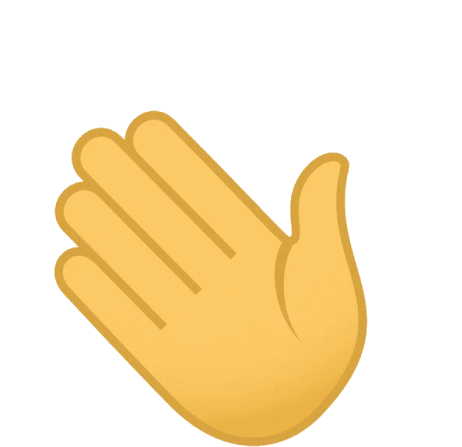

# Hello  I'm Jeff

<h4 align="center"> Telecommunication major passionate in cloud computing and Linux.  
   Open source software enthusiast.</h4>

- 🔭 I'm currently working on [veedy](https://github.com/aspects19/veedy)

- 🌱 I'm currently learning **Rust**

- 👯 I'm looking to collaborate on **Open source projects in python, JavaScript and Rust**

- 👨‍💻 All of my projects are available at [My Portfolio](https://amenya.dev)

- 📫 How to reach me [**hello@amenya.dev**](mailto:hello@amenya.dev)

## 🚧 Projects

Here are a few highlights from my projects:

- [Kyru](https://github.com/aspects19/kyru) - A native GTK Linux gallery app for arranging and showing images and videos on you workstation.
- [Veedy](https://github.com/aspects19/veedy) - A blazing fast all video searcher and downloader Telegram Bot.
- [Darajapy](https://github.com/aspects19/darajapy) - A python wrapper library for Safaricom's Daraja API.

## 🧑‍💻 Skill Stack

            

